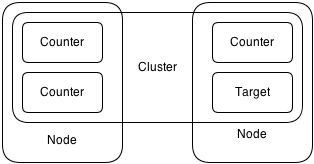
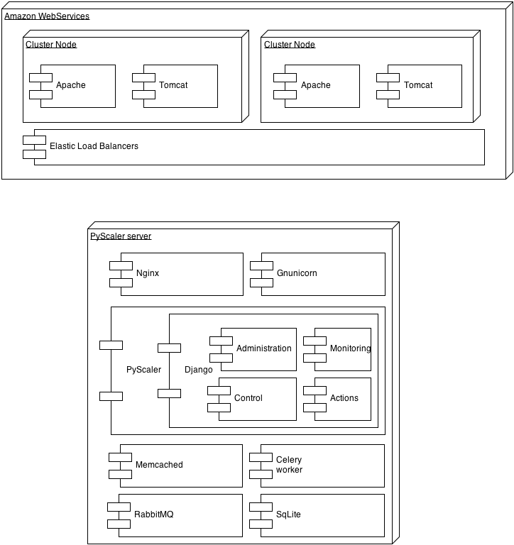
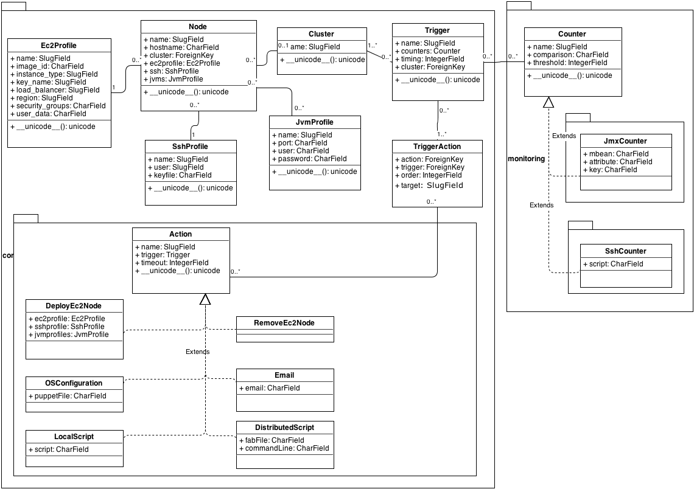

Design
========

Concepts
-----------

- **Node** Virtual machines running applications
- **Cluster** Group of Nodes executing the same applications and work
   together
- **Counter** Performance counter to be gathered. It can be a JMX counter
  on a JVM or an operating system script to be executed via SSH. It has 
  got a Threshold field.

- **Trigger** Group of Counters associated to a Cluster. It has got a Timing 
  field and a list of associated and ordered Actions. When any of the associated
  Counters reaches its threshold during the number of minutes defined in the
  Timing field it will execute the associated Actions

- **Action** Actions that can be executed against Nodes or Clusters. They can be
  for management tasks or to deploy new Nodes if needed. The following actions 
  are available:

 - **DeployEc2Node** Deploy a new virtual machine on EC2 and create a new Node
 - **DistributedScript** Execute a Fabric script
 - **Email** Send an email
 - **LocalScript** Execute a local command in the target (i.e. shell script)
 - **RemoveEc2Node** Stops a virtual machine on EC2 and removes its associated Node
 - **OSConfiguration** Enforce an operating system configuration via Puppet

Main components
---------------------------

Django
~~~~~~~~

`https://www.djangoproject.com/ <https://www.djangoproject.com/>`_

PyScaler is essentially a python web application based on the Django
framework.

The core Django
`MVC <http://en.wikipedia.org/wiki/Model%E2%80%93view%E2%80%93controller>`_ framework
consists of an `object-relational
mapper <http://en.wikipedia.org/wiki/Object-relational_mapping>`_ which
mediates between `data
models <http://en.wikipedia.org/wiki/Data_modeling>`_ (defined as Python
classes) and a `relational
database <http://en.wikipedia.org/wiki/Relational_database>`_ ("Model");
a system for processing requests with a `web templating
system <http://en.wikipedia.org/wiki/Web_template_system>`_ ("View") and
a
`regular-expression <http://en.wikipedia.org/wiki/Regular_expression>`_-based
`URL <http://en.wikipedia.org/wiki/Uniform_Resource_Locator>`_ dispatcher
("Controller").

Django applications are structured in project and apps. A Django project
is a collection of settings for an instance of Django, including
database configuration, Django-specific options and application-specific
settings. A Django app is a bundle of Django code, including models and
views, that lives together in a single Python package and represents a
full Django application.

Django provides a Object-relational Mapping (ORM, O/RM, and O/R mapping)
layer that provides an abstraction layer to the underlying database
backend. Instead of defining database tables, indexes, relationships,
etc..., you define Django models that represent the application data
layout. Django ORM supports many different database backends as SQLite,
MySql, etc...

Celery
~~~~~~~~~

`http://www.celeryproject.org/ <http://www.celeryproject.org/>`_

Celery is an asynchronous task queue/job queue based on distributed
message passing. It is focused on real-time operation, but supports
scheduling as well.

Some common Celery use cases:

#. Running something in the background. For example, to finish the web
   request as soon as possible, then update the users page
   incrementally.
#. Running something after the web request has finished.
#. Making sure something is done, by executing it asynchronously and
   using retries.
#. Scheduling periodic work.

As Django is a web application it just executes code when an url is
called. As PyScaler needs to execute code on a scheduled basis
(performance data collecting, etc...), it relies on Celery scheduling
capabilities to automate the code execution. The Celery component that
handles the periodics tasks is called Celerybeat.

PyScaler can invoke lengthy operations such as virtual machine
deployments, etc... Being PyScaler a web application it is supposed to
be responsive and it can not wait a for this lengthy operations to be
finished. PyScaler overcome this situation by packaging these lengthy
tasks into asynchronous celery task that are executed in the background.

SqLite
~~~~~~~~
`http://www.sqlite.org/ <http://www.sqlite.org/>`_

SqLite is a self-contained, serverless, zero-configuration,
transactional SQL database engine.

It is used on PyScaler as the configuration storage. As PyScaler almost 
configuration storage is minimal and almost not varies, using a simple
database as SqLite eases its management.

For big deployments or high availability reasons it could be easily 
migrated using Django's ORM layer to another RDMBS as MySql, Oracle, etc...

Memcached
~~~~~~~~~~~~~~~~~~~~~~

Memcached is a general-purpose distributed memory caching system. It is often used
to speed up dynamic database-driven websites by caching data and objects in RAM to
reduce the number of times an external data source (such as a database or API) must be read.

In PyScaler it is used to store the gathered performance data. As it is memory based
all queries are really fast and it is easily scalable.

RabbitMQ
~~~~~~~~~~~~~~~~~~~~~~
RabbitMQ is open source message broker software (i.e., message-oriented middleware)
that implements the Advanced Message Queuing Protocol (AMQP) standard. 

It is used by Celery to manage the tasks.

Gunicorn
~~~~~~~~~~~~~~~~~~~~~~

The Gunicorn "Green Unicorn" is a Python Web Server Gateway Interface HTTP Server for Unix.

Although Django provides a basic web server for development it is not suitable for 
production because it is not optimized to handle all types of requests, such as static files,
or high loads. Gunicorn is a pre-fork worker model, ported from Ruby's Unicorn project.
The Gunicorn server is broadly compatible with a number of web application frameworks, 
simply implemented, light on server resources and fairly fast.

Nginx
~~~~~~~~~~~~~~~~~~~~~~
nginx (pronounced "engine x") is an open source web server and a reverse proxy server for
HTTP, SMTP, POP3, and IMAP protocols, with a strong focus on high concurrency, performance
and low memory usage.

Nginx is used to serve the required static files and to proxy dynamic request to Gunicorn,
where Django is executed.

Puppet
~~~~~~~~~~~~~~~~~~~~~~

Puppet is IT automation software that helps system administrators manage infrastructure 
throughout its lifecycle, from provisioning and configuration to patch management and compliance.
Using Puppet, you can easily automate repetitive tasks, quickly deploy critical applications,
and proactively manage change, scaling from 10s of servers to 1000s, on-premise or in the cloud.

It is used by PyScaler to provision Nodes.

Amazon Web Services
~~~~~~~~~~~~~~~~~~~~~~
Amazon Web Services (abbreviated AWS) is a collection of remote computing services
(also called web services) that together make up a cloud computing platform. They are Amazon.com
cloud Infraestructure As A Service offering.

PyScaler makes direct use of EC2 (Elastic Compute Cloud) and ELB (Elastic Load Balancer) although
it can make use of additional services if needed.

Project layout
------------------------------------------

As we have stated before a Django based application has got a project
and different apps. The following section describes how the the project
is organized.

PyScaler project
~~~~~~~~~~~~~~~~~~~~~~

It contains all the settings for an instance of Django. This includes database configuration,
Django-specific options and application-specific settings.

Django apps
~~~~~~~~~~~~~~~~~~~~~~

apps.monitoring app
^^^^^^^^^^^^^^^^^^^^^^^^

This app is responsible of connecting to remote servers and collect
performance data. It is basically a container of different sub apps for each different
possible performance data sources. The currently implemented performance
data sources are SSH and JMX

This app outputs the collected performance data the collected
performance counters to filesystem log and to the shared cache
(memcached)

It provides the following services:

- Contains JMX and SSH apps
- Provides access web page to sub apps

apps.monitoring.jmx app
^^^^^^^^^^^^^^^^^^^^^^^^

This app is used to manage performance data gathered from JVMs via JMX.

It provides the following services:

- JVM counter gathering tasks
- JVM counter graph pages
- JVM counter data api to feed dynamic graph pages

Relevant libraries
%%%%%%%%%%%%%%%%%%%%

- Jpype `http://jpype.sourceforge.net/ <http://jpype.sourceforge.net/>`_ 
  
  This library is used to execute java classes from python scripts. It is
  used in the project to execute JMX related code to collect remote JVMs
  performance data.

apps.monitoring.ssh app
^^^^^^^^^^^^^^^^^^^^^^^^

This app is used to connect via ssh to hosts and execute a script. The
output of this script must be an integer value that represents a
performance counter. This app is defined in the django
package apps.monitoring.ssh

It provides the following services:

- JVM counter gathering tasks
- JVM counter graph pages
- JVM counter data api to feed dynamic graph pages

Relevant libraries
%%%%%%%%%%%%%%%%%%%%

- **Paramiko** `https://github.com/paramiko/paramiko <https://github.com/paramiko/paramiko>`_

  This library is used to execute scripts in remote hosts via SSH from
  python.

apps.control app
^^^^^^^^^^^^^^^^^^^^^^^^

This module contains the business logic of the application. It has the
following roles:

- Manages Cluster and Nodes objects. Can add and remove Nodes
  definitions and handles the Cluster integration
- Triggers the Counters defined in the Clusters’ Triggers
- Triggers groups of actions, either manually or due a Trigger threshold

It provides the following services:

- Launch all performance data gathering tasks
- Analyze performance data and trigger actions if needed
- Serve frontend webpages to execute actions such as scripts and trigger execution
  or node management

apps.actions app
^^^^^^^^^^^^^^^^^^^^^^^^

This module contains the different actions that can be triggered from PyScaler.

Relevant libraries
%%%%%%%%%%%%%%%%%%%%

- **Boto** `https://github.com/boto/boto <https://github.com/boto/boto>`_

   A Python package that provides interfaces to Amazon Web
   Services. It is used to deploy new virtual machines on EC2

- **Fabric** `http://www.fabfile.org <http://www.fabfile.org>`_
  
  A Python (2.5 or higher) library and command-line tool for
  streamlining the use of SSH for application deployment or systems
  administration tasks.

Data Model
-------------------

There are two types of data managed by PyScaler.

Performance data
---------------------

The performance data is stored in Memcached. Data is stored in a dictionary data
structure with the following format 

- **Key / Value format**

  - jmx\_jmxcounter.<nodeId>.<jvmid>.<counterid>.yymmhhddhhmmss : <Value>
  - ssh\_sshcounter.<nodeId>.<counterid>.yymmhhddhhmmss : <Value>

 For example:

 - jmx\_jmxcounter.3.5.201306182046:600
 - ssh\_sshcounter.2.4.201306182046:300

Each monitored counter has got an additional field to store the number of 
times that the threshold has been reached. This is used to trigger actions 
if the threshold has been hit a number of times. Once the threshold is not 
reached then the counter is reset.

- **Key / Value format**

  - jmx\_jmxcounter.<nodeId>.<jvmid>.<counterid> : <Value>
  - ssh\_sshcounter.<nodeId>.<counterid> : <Value>

 For example:

 - jmx\_jmxcounter.3.5:5
 - ssh\_sshcounter.2.4:10

Configuration data
--------------------------------------------------

Django provides an
`Object-relational\_mapping <http://en.wikipedia.org/wiki/Object-relational_mapping>`_  
layer that avoids the need of designing the database layout.

With django you define your data structure by using model classes. A
model is the single, definitive source of data about your data. It
contains the essential fields and behaviors of the data you’re storing.
Generally, each model maps to a single database table. Each module has
got different models that are interconnected between them.

Configuration data models
---------------------------------------------------------

The following models contains the configuration information of PyScaler

New Node deployment steps
-----------------------------------
This sections describes the steps needed to deploy a new node

+--------------------------------------------------+--------------------------------------------+
| STEP                                             |                                            |
+==================================================+============================================+
| Deploy a new VM on EC2 (clustername,user, )      | DeployEC2Node action                       |
+--------------------------------------------------+--------------------------------------------+
| Add the node to the Elastic Load Balancer        | DeployEC2Node action                       |
+--------------------------------------------------+--------------------------------------------+
| Operating system configuration and provisioning  | OSConfiguration action                     |
+--------------------------------------------------+--------------------------------------------+
| Tomcat configuration                             | LocalScript or DistributeScript actions    |
+--------------------------------------------------+--------------------------------------------+
| Application deployment                           | LocalScript or DistributeScript actions    |                   
+--------------------------------------------------+--------------------------------------------+
| Cluster update                                   | LocalScript or DistributeScript actions    |
+--------------------------------------------------+--------------------------------------------+
| Notification                                     | Email action                               |
+--------------------------------------------------+--------------------------------------------+