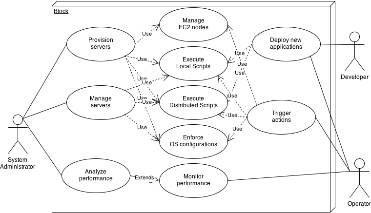

Use Cases
============

The PyScaler service can be used to:

- As a System Administrator:
   - Analyze performance
   - Manage servers
   - Provision servers
- As a developer:
   - Deploy new applications
- As a Server Operator:
   - Deploy new applications
   - Monitor performance
   - Trigger actions

This use cases can be accomplished using the provided actions:

- Manage EC2 nodes
- Execute local scripts
- Execute distributed scripts
- Enfoce OS configurations

