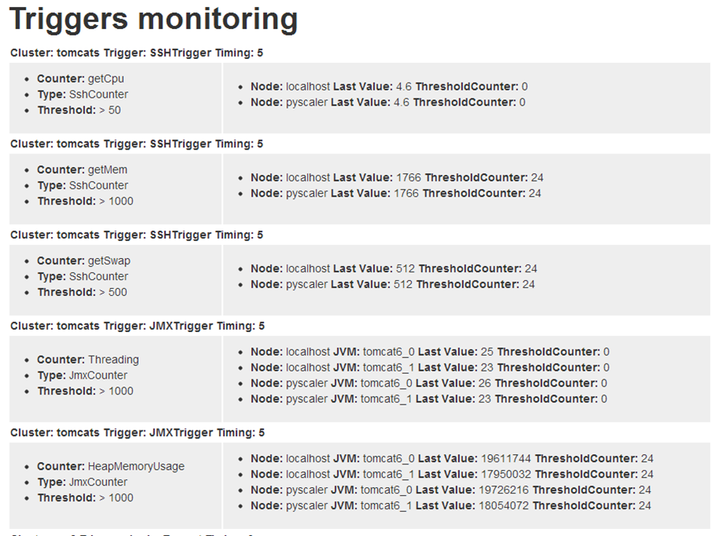

User Guide
====================================

The main interface of PyScaler can be accessed via web page. The exact address will very depending of the deployment type:

- If serving the Django application via Django's runserver it will answer to something like http://pyscaler:8000
- If serving used a webserver such as Apache+mod_wsgi or Nginx+gunicorn, it will respond to something like http://pyscaler

Start page
------------------
The landing page is the following, where you can access all the PyScaler web interface.

.. image:: images/pyscalerWelcome.png

Monitoring pages
-----------------------

From the monitoring pages you can access to the different performance graphs per cluster, node or jvm and counter type.

All the graphs in these pages can be zoomed by selecting areas in the graphs and then reseted back to its initial state
by clicking on their zoom reset button.

JMX monitoring
~~~~~~~~~~~~~~~~~~~~~~~~~~

- Cluster

Can be accessed through the menu **Monitoring -> JMX -> Cluster**

.. image:: images/pyscalerJMXCluster.png
   :scale: 80 %

- Node

Can be accessed through the menu **Monitoring -> JMX -> Node**

.. image:: images/pyscalerJMXNode.png
   :scale: 80 %

- Jvm

Can be accessed through the menu **Monitoring -> JMX -> Jvm**

.. image:: images/pyscalerJMXJVM.png
   :scale: 80 %

SSH monitoring
~~~~~~~~~~~~~~~~~~~~~~~~~~

- Cluster

Can be accessed through the menu **Monitoring -> Ssh -> Cluster**

.. image:: images/pyscalerSSHCluster.png
   :scale: 70 %

- Node

Can be accessed through the menu **Monitoring -> Ssh -> Node**

.. image:: images/pyscalerSSHNode.png
   :scale: 70 %

Trigger monitoring
~~~~~~~~~~~~~~~~~~~~~~~~~~

Can be accessed through the menu **Monitoring -> Trigger monitoring**

   

Control
~~~~~~~~~~~~~~~~~~~~~~~~~~

- Execution of Distributed Scripts

Can be accessed through the menu **Control-> Distributed Scripts**

.. image:: images/pyscalerDistributedScripts.png

- Execution of Local Scripts

Can be accessed through the menu **Control-> Local Scripts**

.. image:: images/pyscalerLocalScripts.png

Provisioning
~~~~~~~~~~~~~~~~~~~~~~~~~~

- EC2 nodes provisioning

Can be accessed through the menu **Provisioning -> Ec2 Nodes**

.. image:: images/pyscalerEC2Nodes.png

- Operating system configuration

Can be accessed through the menu **Provisioning -> OS configurations**

.. image:: images/pyscalerOSConfiguration.png

Administration
~~~~~~~~~~~~~~~~~~~~~~~~~~
All these screens can be accessed through the menu **Administration**

- Cluster administration

.. image:: images/pyscalerAdministrationCluster.png

- Node administration

.. image:: images/pyscalerAdministrationNode.png

- EC2 profile administration

.. image:: images/pyscalerAdministrationEc2Profile.png

- JVM profile administration

.. image:: images/pyscalerAdministrationJVMProfile.png

- Ssh profile administration

.. image:: images/pyscalerAdministrationSshProfile.png

- EC2Node profile administration

.. image:: images/pyscalerAdministrationDeployEc2Node.png

- Distributed Script administration

.. image:: images/pyscalerAdministrationDistributedScript.png

- Local Script administration

.. image:: images/pyscalerAdministrationLocalScript.png

- Email administration

.. image:: images/pyscalerAdministrationEmail.png

- JMX counter administration

.. image:: images/pyscalerAdministrationJmxCounter.png

- Trigger administration

.. image:: images/pyscalerAdministrationTrigger.png