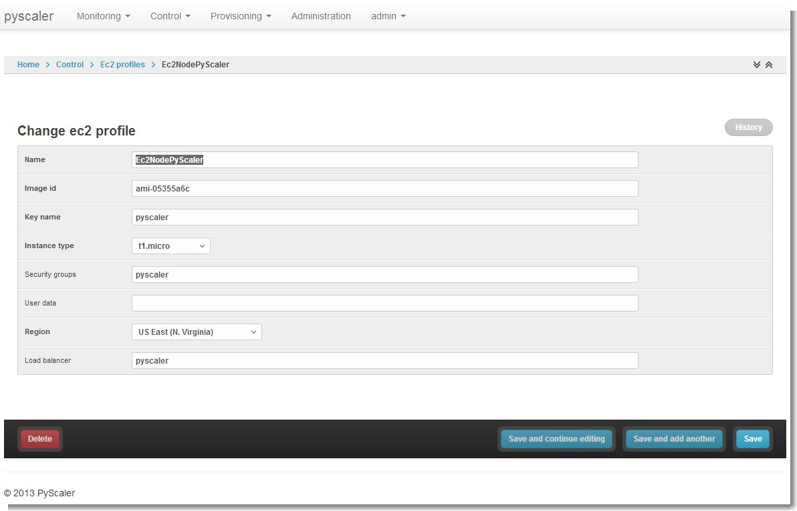
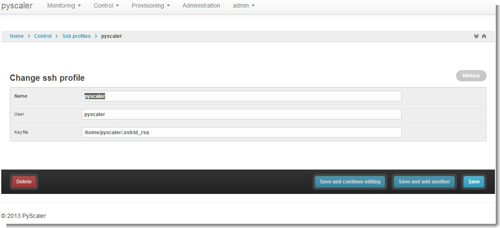
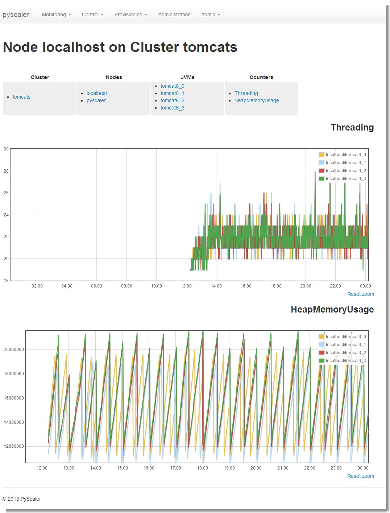
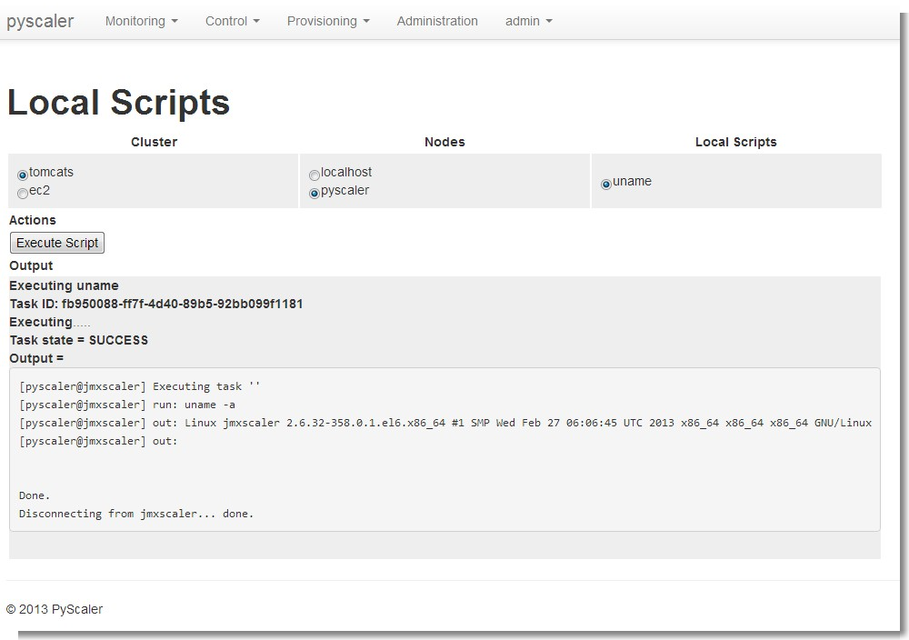

User Guide
====================================

pyscalerAdministrationCluster

.. image:: images/pyscalerAdministrationCluster.png

pyscalerAdministrationDeployEc2Node

.. image:: images/pyscalerAdministrationDeployEc2Node.png

pyscalerAdministrationDistributedScript

.. image:: images/pyscalerAdministrationDistributedScript.png

pyscalerAdministrationEc2Profile

pyscalerAdministrationEmail

.. image:: images/pyscalerAdministrationEmail.png

pyscalerAdministrationJmxCounter

.. image:: images/pyscalerAdministrationJmxCounter.png

pyscalerAdministrationJVMProfile

.. image:: images/pyscalerAdministrationJVMProfile.png

pyscalerAdministrationLocalScript

.. image:: images/pyscalerAdministrationLocalScript.png

pyscalerAdministrationNode

.. image:: images/pyscalerAdministrationNode.png

pyscalerAdministrationSshProfile

pyscalerAdministrationTrigger

.. image:: images/pyscalerAdministrationTrigger.png

pyscalerDistributedScripts

.. image:: images/pyscalerDistributedScripts.png

pyscalerEC2Nodes

.. image:: images/pyscalerEC2Nodes.png

pyscalerJMXCluster

.. image:: images/pyscalerJMXCluster.png

pyscalerJMXJVM

.. image:: images/pyscalerJMXJVM.png

pyscalerJMXNode

pyscalerLocalScripts

pyscalerSSHCluster

.. image:: images/pyscalerSSHCluster.png

pyscalerSSHNode

.. image:: images/pyscalerSSHNode.png

pyscalerWelcome

.. image:: images/pyscalerWelcome.png

